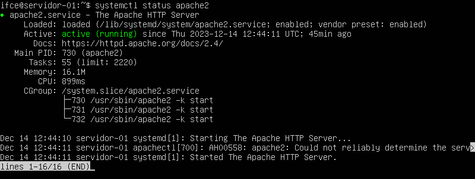
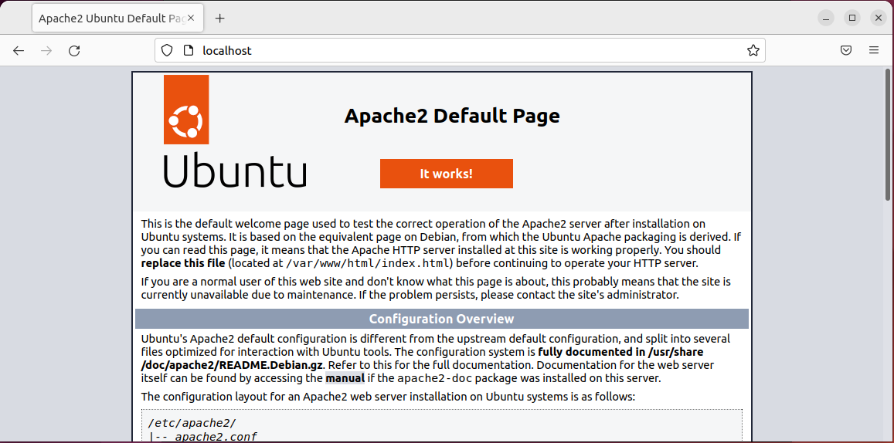
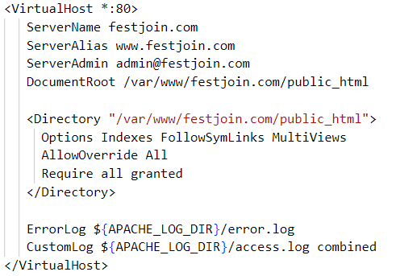
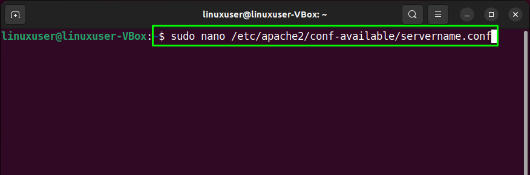

# INSTRUÇÕES PARA A REALIZAÇÃO DA PRÁTICA 4 - SERVIDOR WEB APACHE

Nesse ponto da disciplina vamos aprender a instalar e configurar um servidor Web para hospedar sites e recursos Web em nossa máquina servidora. Vamos trabalhar com o Apache HTTP Server em nosso servidor Ubuntu Server, entendendo como podemos configurá-lo de forma básica para prover recursos e sites Web dentro de nossa rede interna (o mesmo procedimento é feito em serviços de hospedagem online).

Neste repositório, na pasta [`sites`](pratica-4/sites) vocês encontrarão dois diretórios com exemplos de sites para utilizarem como teste de hospedagem em nosso servidor. Então, inicialmente atualizem o repositório local com o comando `git pull` dentro do diretório `recursos-servidores` na máquina virtual servidora. Após isso, prossigam com a realização desta prática, seguindo os passos abaixo:

## Configuração básica

1. Atualize os repositórios do sistema: `$ sudo apt update`

2. Instale o Apache HTTP Server: `$ sudo apt install apache2`

3. Verifique o status do serviço apache2: `$ systemctl status apache2`

   - A saída deve ser semelhante à imagem abaixo, mostrando que o serviço está em execução.
     
   - Você também pode verificar se deu tudo certo acessando o IP do servidor pelo navegador de uma máquina cliente na rede interna ou pelo IP do servidor, acessível pela rede externa, no navegador de nossa máquina física (já que estamos utilizando máquina virtual). Você deve conseguir acessar uma página semelhante a essa:
     

4. Agora seria o momento de criar os diretórios para armazernar e organizar os recursos dos nossos sites. No Unbuntu Server, esses diretórios devem ser colocados na pasta `/var/www/`. Então, se queremos hospedar um site chamado `site1.com` devemos criar um diretório para ele dentro dessa pasta, como por exemplo: `/var/www/site1.com/`. No entanto, vocês podem simplesmente copiar os diretórios presentes neste repositório, na pasta `sites`:

   - Com o repositório atualizado na máquina servidora:
     - `$ sudo cp -r pratica-4/sites/festjoin.com /var/www/`
     - `$ sudo cp -r pratica-4/sites/series.com /var/www/`
   - Verifique o conteúdo dos diretórios copiados para a pasta `/var/www/`:
     - `$ sudo ls /var/www/festjoin.com`
     - `$ sudo ls /var/www/series.com`

> [!NOTE]
> Percebam que dentro do diretório de cada sites de exemplo tem um subdiretório chamado `public_html`. Esse é um padrão adotado profisisonalmente em serviços de hospedagens de sites, mantendo todo o conteúdo do site a ser provdido em uma pasta padrão, nomeada por convenção.

5. Agora é necessário definir corretamente as permissões para as pastas criadas para que o usuário logado consiga manipulá-las corretamente, bem como o serviço apache2. Para isso, faça o seguinte:

   - Adicione o usuário do apache ao grupo do usuário que está logado: `$ sudo usermod -a -G www-data $USER`
   - Altere o grupo proprietário da pasta `/var/www` para o grupo do apache: `$ sudo chown -R $USER:www-data /var/www`
     - Obs.: a variável $USER representa o usuário que está logado no momento
   - Por fim, vamos definir as permissões corretas para o usuário e para o grupo: `$ sudo chmod -R 775 /var/www`
     - Obs.: a permisão 775 indica que o usuário e o grupo donos do diretório tem acesso total e os demais usuário podem visualizar e executar (acessar o site), mas não podem alterar nenhum arquivo.

## Configuração dos arquivos de Virtual Hosts

6. Nesse ponto, já temos as configurações básicas aplicadas para nosso servidor, porém ainda não conseguimos acessar individualmente cada site. Precisamos então configurar os **Os Hosts Virtuais** para nossos sites. Os arquivos de de `Virtual Hosts` são responsáveis pela configuração de cada domínio que queremos hospedar em nosso servidor. Logo, com essa abordagem, conseguimos hospedar vários sites com diferentes domínios em um mesmo servidor (isso é o que ocorre normalmente em servidores online).

7. O apache já vem com um arquivo de configuração padrão para **Virtual Host**. Poderíamos então, copiar esse arquivo para aproveitá-lo como base para a configuração de cada site, por exemplo para o site `festjoin.com`: `$ sudo cp /etc/apache2/sites-available/000-default.conf /etc/apache2/sites-available/festjoin.com.conf`

   - Porém, este repositório já contem os arquivos de configuração de cada **Virtual Host** para os dois sites de exemplo, copie cada arquivo para a pasta `/etc/apache2/sites-available`.
     - `$ sudo cp -r ~/recursos-servidores/pratica-4/config/festjoin.com.conf /etc/apache2/sites-available`
     - `$ sudo cp -r ~/recursos-servidores/pratica-4/config/series.com.conf /etc/apache2/sites-available`
   - Os arquivos tem o seguintes conteúdo:
     - `festjoin.com.conf`:
       
     - `series.com.conf`:
       
   - Explicando resumidamente precisamos definir um `ServerName` (nome de dóminio do servidor), geralmente colocando o nome de domínio do nosso site, por exemplo `festjoin.com` e um `ServerAlias` (apelido ou outro endereço associado), por exemplo `www.festjoin.com`. Ainda é necessário indicar o diretório raiz do nosso sites (onde o apache vai prover os arquivos), por exemplo `/var/www/festjoin.com/public_html`. Por fim, indicamos o email do administrador do site em `ServerAdmin` e definimos os locais dos logs de erro, _warnings_ e etc.

8. Ative os arquivos de virtual host com os comandos:

- `$ sudo a2ensite festjoin.com.conf`
- `$ sudo a2ensite series.com.conf`

9. Reinicie o apache: `$ sudo systemctl restart apache2 restart`

10. Teste as configurações: `$ sudo apache2ctl configtest`

- Em caso de receber somente a mensagem `Syntax OK`, significa que não foram encontrados erros nos arquivos de configuração.
- Porém, é comum aparecer a seguinte mensagem:
  
  - Se esse for o seu caso, acesso o arquivo `servername.conf` e adicione seu nome de domínio: `$ sudo nano /etc/apache2/conf-available/servername.conf`
  - Adicione a seguinte linha no arquivo e salve: `Servername localhost`
    > [!NOTE]
    > Se tivéssemos um nome de dóminio válido públicamente, poderíamos colocar aqui.
  - Em seguida, ative a nova configuração: `$ sudo a2enconf servername`
  - Por fim, reinicie o serviço apache2: `$ sudo systemctl restart apache2`

11. Agora vamos testar nosso sercidor Web a partir do navegador da máquina cliente na rede interna, ou por meio da máquina física.

- Em ambos os casos, devemos alterar o arquivo de `hosts` do sistema cliente para que ao digitar o nome de domínio dos nossos sites no navegador, o sistema não encaminhe essa URL para o servidor DNS e resolva localmente. Isso é necessário porque não temos nenhum servidor DNS configurado localmente e nossos nomes de domínios não estão registrados publicamente na Internet.
- Para isso, siga os passos apontados:
  - Sistemas Ubuntu/Debian:
  - `$ sudo nano /etc/hosts`
  - Dentro do arquivo adicione as linhas:
    - `IP_SERVIDOR festjoin.com`
    - `IP_SERVIDOR series.com`
  - Sistemas Windows:
    - Abra o bloco de notas como administrador e abra o arquivo `C:\Windows\System32\drivers\etc\hosts` e insira as linhas indicadas anteriormente
  - Obs.: lembre-se de substituir `IP_SERVIDOR` pelo IP correto do servidor (IP externo, se testar na máquina física, IP interno ao testar em uma máquina virtual cliente na rede interna)
